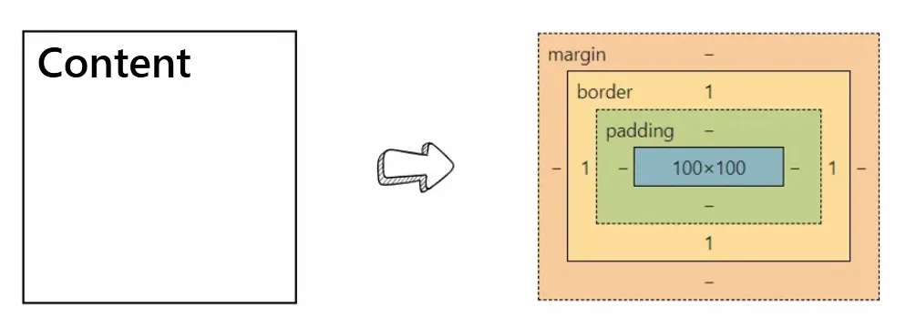

# CSS Box Model
## [1] 박스 모델 구성요소 

1. content : 내부 콘텐츠 영역
2. padding : 콘텐츠 영역과 테두리 사이 공간
3. border : 테두리
4. margin : 테두리와 다른 박스 사이의 간격

## [2] Box 내부 설정
1. content
2. padding
3. background
4. overflow
5. content-box
6. border-box

## [3] Box 외부 설정
1. border
2. border-radius
3. box-shadow
4. margin
  
## [4] CSS Display
### Block  

  `<span>`태그는 원래 inline요소이지만, block요소로 변환 후 너비와 높이를 가질 수 있음

```html
<span>Learn</span>
```
```css
span {
		  display: block;
      width: 100px;
      height: 100px;
      border: 1px solid black;
}
```

### Inline

`<div>` 태그는 원래 block 요소이지만, inline 요소로 변환 후 콘텐츠 영역에 한정하여 박스 크기가 줄었으며, 행을 꽉 채우지 않고 요소 옆에 위치할 수 있게 됨

```html
<div>Learn</div>
<div>HTML/CSS</div>
```

```css
div {
      display: inline;
}

div + div {
      background-color: #12FF18;
}
```

### Inline-block

`<span>` 태그는 너비, 높이, 마진, 패딩이 모두 설정 가능해졌으며, 인라인 요소처럼 오른쪽으로 쌓이게 됨

```html
<span>Learn</span>
<span>HTML/CSS</span>
```

```css
span {
      width: 100px;
      height: 50px;
      margin: 10px;
      padding: 10px;
			border: 1px solid black;
      background-color: #12ff18;
      display: inline-block;
}
```

### None

> 요소가 레이아웃에 영향을 주지 않도록 화면에서 보이지 않게 설정
> 

```html
<div>Learn</div>
<div>HTML/CSS</div>
```

```css
div {
      width: 100px;
      height: 50px;
      border: 1px solid black;
      margin: 10px;
}

div:first-child {
      display: none;
}
```

### Visible

> 요소가 보이게끔 설정하며, `visible`이 기본값

### Hidden

<aside>
💡 Display None과 Visibility Hidden 차이

</aside>

`None`은 눈에 안 보일 뿐만 아니라 요소 자체가 차지하는 공간을 없애게 된다. `Hidden`은 눈에 보이지 않을 뿐 요소가 차지하는 공간 자체는 남아 있다.

```html
<div>Learn</div>
<div>HTML/CSS</div>
```

```css
div {
      width: 100px;
      height: 50px;
      border: 1px solid black;
      margin: 10px;
}

div:first-child {
      visibility: hidden;
}
```

### Opacity

 `0`(투명)부터 `1`(불투명) 사이의 값을 입력

```html
<div></div>
<div></div>
```

```css
div {
      width: 256px;
      height: 256px;
      background: url("dailyalgo_logo.png");
      display: inline-block;
}

div:first-child {
      opacity: 0.5;
}
```