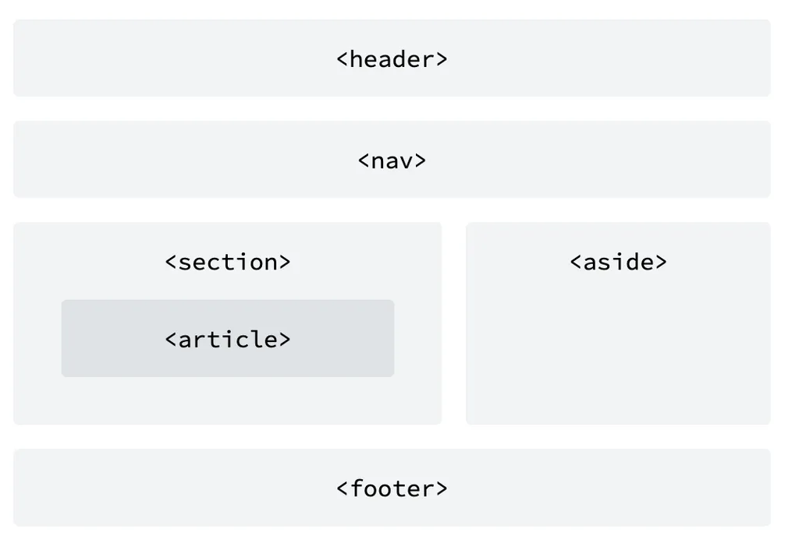
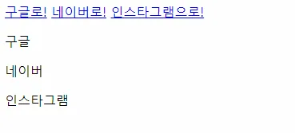

# HTML Tags
## [1] Non-Semantic Tags
1. div : 영역을 구분하나, 특정 의미는 가지지 않는다.
2. span : 텍스트 콘텐츠 요소이나 콘텐츠 내용을 특정하지 않는다.
   
## [2] Semantic Tags
1. h1 ~ h6 : 문서의 제목을 나타낸다. 
   
   
2. header : 문서 전체나 섹션의 헤더
3. nav : 네비게이션 바
4. aside : 사이드에 해당하는 공간
5. section : 특정 컨텐츠 그룹
6. article : 화면 안에서 독립적으로 구분되는 영역
7. footer : 문서의 마지막 부분

## [3] Inline과 Block 요소의 차이
- Inline 요소는 줄바꿈이 없고 너비와 높이를 지정하지 못함
- Block 요소는 별다른 지정이 없다면 좌우로 최대한 늘어남 

```html
  <body>
    <!-- Inline 요소 -->
    <a href="www.google.com">구글로!</a>
    <a href="www.naver.com">네이버로!</a>
    <a href="www.instagram.com">인스타그램으로!</a>
    <!-- Block 요소 -->
    <p>구글</p>
    <p>네이버</p>
    <p>인스타그램</p>
  </body>
```


## [4] HTML 폼
### (1) HTML 폼 구조
#### form
기입 양식을 담는 틀을 생성한다. 
``` html
  <form>
    <label>정보 :</label>
    <input type="text">
    <button>전송</button>
  </form>
```


### (2) 폼 구성요소
#### label
해당 인풋에 대한 설명 제공
``` html
<label for="name_input">이름을 입력하세요 : </label>
<input type="text" id="name_input">
```
#### Input
실제 입력을 받는 부분 
```html
<input type="">
```
1. text
  - `placeholder`를 이용해 입력값이 아직 없는 경우 보여줄 문구를 지정할 수 있음 
2. password
  - `required` 속성을 사용해 필수 항목으로 지정할 수 있습니다.
    ```html
    <label>비밀번호 :</label>
    <input type="password" required>
    ```
3. email
4. number
  - `max` & `min` 속성을 사용해 범위 지정 가능 
5. range
6. submit
  - 입력 버튼 생성, 버튼 태그와 외관이 같음 
7. file
8. checkbox

#### textarea
여러줄의 텍스트를 입력받을 수 있는 양식을 생성 
`rows`속성은 몇 줄을 쓸것인지, `cols` 속성은 한 줄당 기입 가능한 공간이 몇인지 지정 
```html
<label for="my_textarea">여러줄 입력 :</label>
<textarea name="여러줄 입력" id="my_textarea" cols="30" rows="10"></textarea>
```

#### button
일반적으로는 버튼이지만, `<form>`태그 안에 쓰였을 경우는 `input type-"submit"`과 같은 효과를 준다.
버튼 태그는 기본 CSS 스타일링 요소가 포함되어 있음 