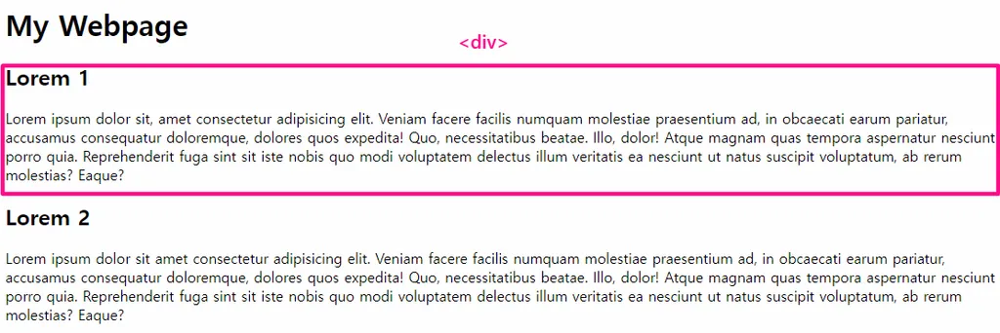

# HTML 기초
html에 대해서 공부하면서 새로운 것들, 외워둘 것들 등등에 대해서 정리해 나가는 파일

## [1] HTML 기초 지식 
> HTML (Hyper Text Markup Language)

마크업 예시 

HTML/CSS를 대 제목으로 표기하고 싶은 경우 `<h1>` 태그를 활용
```html
<h1>HTML/CSS</h1>
```
문단(paragraph)을 표기하고 싶은 경우 `<p>` 태그를 활용
```html
<p>Hypertext Markup Language는 문서의 논리적인 구조를 표기하는 언어입니다.</p>
```
>HTML File 구조
```html
<!DOCTYPE html>
<html lang="ko">
<head>
  <meta charset="UTF-8">
  <title>HTML 연습</title>
  <link rel="stylesheet" href="CSS파일 주소">
  <style>
    /* CSS 코드 */
  </style>
  <script>
    // Javascript 코드
  </script>
</head>
<body>
  <!-- 브라우저에서 보일 공간입니다. -->
  <h1>HTML/CSS</h1>
  <p>Hypertext Markup Language는 문서의 논리적인 구조를 표기하는 언어입니다.</p>
</body>
</html>
```

## [2] HTML File 구조

### (1) <!DOCTYPE>
>문서의 유형을 정의하기 위해 사용하는 선언문

HTML 문서의 최상단에 위치하며, 그 아래에 `<html>` 태그가 위치하게 된다.

### (2) `<html>`
>문서의 최상위 요소(root)

선언문을 제외한 모든 요소를 감싸는 태그이다. `<html>` 태그는 `<head>` 태그와 `<body>` 태그로 나뉘게 됩니다.

### (3) `<head>`
>메타데이터(다른 데이터를 설명하는 데이터)를 통해 문서의 정보를 나타낸다.

`<head>` 태그 안에 쓰이는 요소 

1. `link`
- 외부 리소스를 연결해주는 태그
- rel속성으로 관계를 명시하고, href 속성으로 주소를 명시
```html
<link rel="stylesheet" href="https://maxcdn.bootstrapcdn.com/bootstrap/3.3.2/css/bootstrap.min.css">
```
2. `meta`
- `<link>`,`<script>`,`<style>`,`<title>`등으로 나타낼 수 없는 메타데이터를 담는다.

3. `title`
- 브라우저 페이지 탭의 문서 제목에 대한 정보를 담는다.
```html
<title>탭 제목</title>
```

4. `style`
- 문서의 CSS 스타일 정보를 담는다. 해당 태그는 link로 별도의 스타일 시트를 지정하지 않고 직접 문서를 스타일링 할 때 사용한다. 
```html
 <style>
   /* CSS 코드 */
 </style>
```
5. `script`
- Javascript 코드를 작성하는 공간

- `src` 속성을 통해 외부 리소스를 참조할 수 있다.
### (4) `<body>`
>실제 브라우저 화면에 레이아웃될 태그들이 위치

모던 브라우저에서는 `<body>`태그 안의 요소들만 나열해도 렌더링을 해준다.

## [3] HTML 요소
### (1) 요소(Element)
> HTMl의 요소는 태그와 내용(contents)으로 구성되어 있다. 

다음과 같은 빈 요소(void elements)인 일부 태그들은 종료 태그가 없다.
```
<link>, <meta>, <br>, <hr>, <input>, 
```

요소는 중첩(next)될 수 있다. 
```html
<span>Learn<br>HTML<br>CSS</span>
```

### (2) 속성(Attribute)
>태그와 관련한 부가적 정보를 설정할 수 있다. 

일부 요소는 속성을 가질 수 있으며, 속성은 속성값을 가질 수 있다. 

속성은 모든 태그에 공통적으로 쓰일 수 있는 속성(HTML Global Attribute)과 일부 태그에만 쓰일 수 있는 속성으로 나뉜다.
```html
<link rel="stylesheet" href="my.css">
```
`<link>`태그를 살펴보면, `rel`은 속성이고 `stylesheet`는 속성값이다. 
속성값은 쌍따옴표로 표기하며, =과 "사이에는 위의 예제와 같이 공백이 존재하지 않는다. 

## [4] 주석
`주석`(comment)은 HTML 코드에는 영향을 주지 않는 코드에 대한 설명이나 디버깅을 위해 작성한 구문

HTML 주석은 다음과 같이 표기한다.
```html
<!-- 주석 내용 -->
<!-- 
	여러 줄 주석은 이렇게 표현합니다.
-->
```
>💡주석 단축키는 Control + Slash(/) 
## [5] 개발자 도구
>개발자 도구를 활용해 작성한 HTML 파일을 분석할 수 있다.

Chrome 브라우저 우측 상단의 아이콘 -> 도구 더보기 -> 개발자 도구를 통해 들어간다. 

>단축키

Windows :  F12 혹은 Control + Shift + i

Mac : Option + Command + i

>Select Element Button


해당 버튼을 활용해 요소를 클릭하면, Element Tab과 Styles Tab에서 해당 요소에 관련한 정보를 얻을 수 있다.


## [6] HTML Tags
### (1) 콘텐츠 구분
1. h1 ~ h6
  > 제목을 표시하며, 문서의 논리적 흐름을 나타낸다.

    ❗단순히 글씨 크기를 키우기 위한 용도로 사용하면 안됨
  - 뉴스 주제 : `h1`
    - 경제 : `h2`
        - 금융 : `h3`
        - 부동산
    - 사회 : `h2`
        - 사회 일반
        - 인권/복지
    - 스포츠 : `h2`
        - 축구
        - 농구
        - 야구
2. p
  > 문단을 구분할 때 사용  
3. div
  > HTML 문서에서 `<div>`는 아래의 그림과 같이 하나의 영역을 구분  

  

4. hr
  > 콘텐츠 사이 수평선을 표시 
  ``` html
    <body>
    <div>Learn</div>
    <!-- 수평선을 표시합니다. -->
    <hr> 
    <div>HTML/CSS</div>
    </body>
  ```
  `<hr>`태그는 닫는 태그가 필요 없는(self-closing) 태그이다.
### (2) 텍스트 관련
1. span
  > 텍스트 콘텐츠를 나타낸다. 
   
   ```html
    <body>
    <span>Learn</span>
    <span>HTML</span>
    <!-- 3번째 span은 영향이 없습니다. -->
    <span></span>
    <span>CSS</span>
    </body>
   ```
2. a(Anchor)
  > 다른 페이지로 이동할 수 있는 하이퍼링크를 생성
   ```html
    <a href="https://www.google.com" target="_blank">구글로!</a>
   <a href="https://www.naver.com" title="네이버로 갈까요?">네이버로!</a>
   <a href="https://www.instagram.com">인스타그램으로!</a>
   ```
  > 속성 정리

  | 속성 목록 | 상세 설명 | 속성값 |
  | --- | --- | --- |
  | href (Hyperlink Reference) | 웹 사이트 주소를 명시 |  |
  | target | 열릴 위치를 지정  | _blank,  _self, _top, _parent |
  | title | 링크에 마우스 오버시 도움말 설정 |  |

3. b & strong
  > 텍스트를 <b>강조</b>
4. i & em
  > 텍스트를 <i>기울임체로</i>
5. br 
  > 줄바꿈 <br>효과
  
  `<br>` 태그는 self-closing 태그

## (3) 목록 생성 
1. li 
  > 리스트의 하위항목 표시
  ```html
  <li>Learn</li>
  <li>HTML</li>
  <li>CSS</li>
  ```

2. ul
  > 순서가 없는 리스트
  ```html
  <ul>
    <li>Learn</li>
    <li>HTML</li>
    <li>CSS</li>
  </ul>
  ``` 
  <h1>Unordered List</h1>
  <ul>
    <li>Learn</li>
    <li>HTML</li>
    <li>CSS</li>
  </ul>

3. ol
  > 순서가 있는 리스트
  ```html
  <ol>
    <li>Learn</li>
    <li>HTML</li>
    <li>CSS</li>
  </ol>
  ``` 
  <h1>Ordered List</h1>
  <ol>
    <li>Learn</li>
    <li>HTML</li>
    <li>CSS</li>
  </ol>
   
## (4) 이미지와 멀티미디어 
1. img
  > `` 태그는 self-closing태그
  ```html
  
  ```
  | 속성 목록 | 상세 설명 | 
  | --- | --- |
  | src | 이미지 주소를 명시(외부, 내부 주소 가능) | 
  | alt | 대체 텍스트  |
  | draggable | false 설정 시 마우스로 드래그 불가능 |
2. iframe
  > 비디오를 삽입
  ```html
  <iframe width="560" 
        height="315" 
        src="https://www.youtube.com/embed/D0UnqGm_miA" 
        title="YouTube video player" 
        frameborder="0" 
        allow="accelerometer; autoplay; clipboard-write; encrypted-media; gyroscope; picture-in-picture" 
        allowfullscreen>
  </iframe>
  ``` 
| 속성 목록 | 상세 설명 |
| --- | --- |
| height | 높이 지정 |
| width | 너비 지정 |
| src | 비디오 주소를 명시 |
| title | iframe 요소 제목 |
| frameborder | 테두리 속성 |
| allow | 허용 여부 |
| allowfullscreen | 전체화면 허용 여부 |